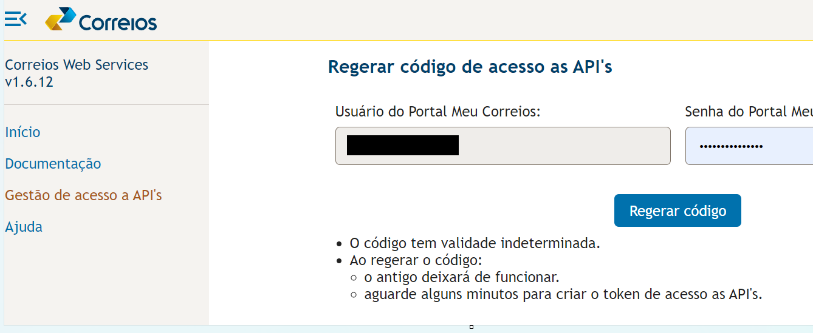

<!--
This README describes the package. If you publish this package to pub.dev,
this README's contents appear on the landing page for your package.

For information about how to write a good package README, see the guide for
[writing package pages](https://dart.dev/guides/libraries/writing-package-pages).

For general information about developing packages, see the Dart guide for
[creating packages](https://dart.dev/guides/libraries/create-library-packages)
and the Flutter guide for
[developing packages and plugins](https://flutter.dev/developing-packages).
-->

Plugin de acesso a API dos correios para clientes com contrato.
## Features
Somente a API de Preço foi implementada.


## Getting started

Para acessar a API de Preço e Prazo dos correios, antes é necessário realizar um contrato através da página https://www.correios.com.br/correios-facil/correios-facil. O processo é online e a assinatura do contrato é realizado por meio de certificado digital e-CNPJ.
A documentação da API está disponível em https://www.correios.com.br/atendimento/developers/arquivos/manual-para-integracao-correios-api

# Gerando um código de acesso
Na página da API dos correios (https://cws.correios.com.br/acesso-componentes) Acesse o menu Gestão de acesso a API´s e gere um código que você irá utilizar para obter um token de autorização. 



## Usage

TODO: Include short and useful examples for package users. Add longer examples
to `/example` folder.

```dart
const like = 'sample';
```

## Additional information

TODO: Tell users more about the package: where to find more information, how to
contribute to the package, how to file issues, what response they can expect
from the package authors, and more.
